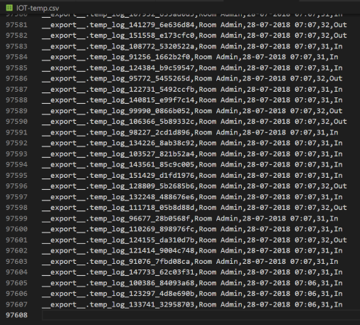

# Project 2 Big Data

| Nama Lengkap          | NRP           |
| :-------------------: | :-----------: |
| Agas Ananta Wijaya    | 5027221004    |
| Asadel Naufaleo       | 5027221009    |
| Michael Wayne         | 5027221037    |

## Dokumentasi Pengerjaan

1. Pada api_1, model *ditraining* menggunakan 97606 data

2. Pada api_2, model *ditraining* menggunakan 65070 data 

3. Pada api_3, model *ditraining* menggunakan 32536 data

